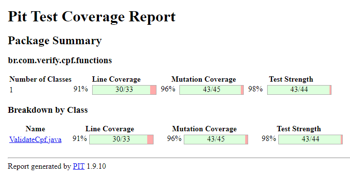

# Testes Unitários e de Mutação

Esse projeto é para reforçar o entendimento de teste unitário e de mutação.

A ideia é realizar testes unitários e de mutaçaão, para verificar se as funções que validam o CPF recebido não possuem falhas.

O teste de mutação vai verificar a cobertura dos testes unitários, onde ao identificar que existem mutações vivas, significa que deve-se melhorar os testes unitários.

Caso queira rodar o projeto basta executar o comando abaixo.

    mvn test-compile org.pitest:pitest-maven:mutationCoverage

## Resultado

